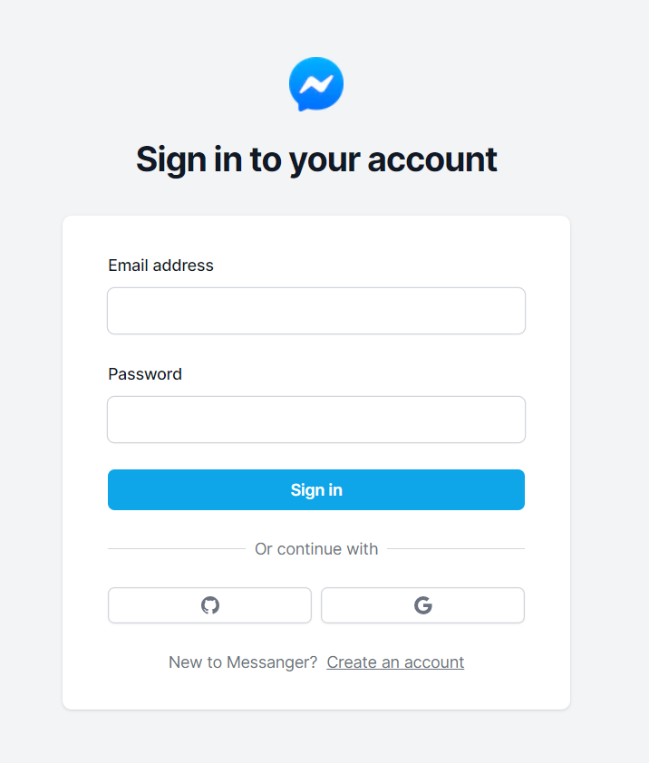
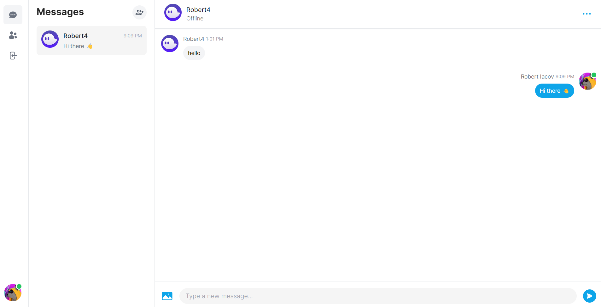
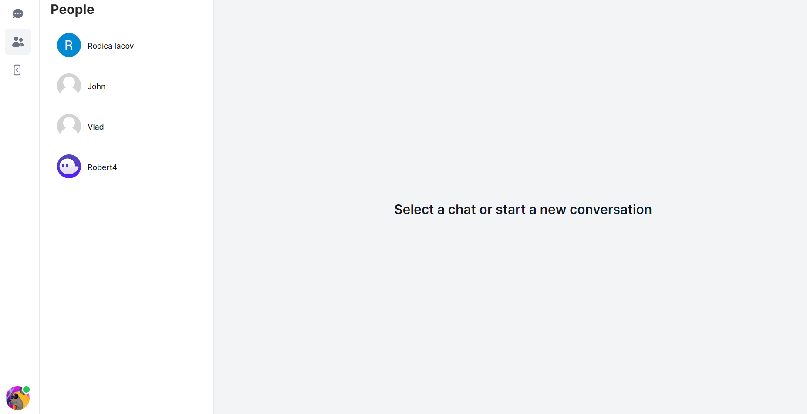
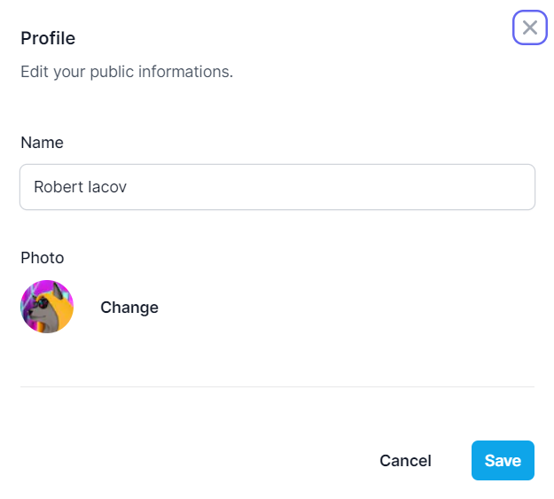

# Messanger Web Application

  A messanger app where users can chat in realtime with one or multiple users.

## Features:

- User Authentication with there account or using OAuth from Github or Google (Sign Up / Sign In).
- Realtime Chatting between users using Pusher service.
- Users page.
- Users can edit there own profiles.
- Users can delete conversation tabs.
- Can create a group conversation with min. of 2 users.
- Posibility to post images in conversations.
- Responsive UI Design.

## Technologies used:
- Next.Js Framework
- Tailwindcss
- Pusher Service
- Mongo DB
- Next Auth
- Cloudinary
- Vercel

## Screenshots of application:









<br>

## Soon features:
- Posibility to toggle switch between dark / light mode.
- Send GIFs in conversation.
- Time last online of users.
  <br>

First, run the development server:

  

```bash

npm  run  dev

# or

yarn  dev

# or

pnpm  dev

```

  

Open [http://localhost:3000](http://localhost:3000) with your browser to see the result.

  

You can start editing the page by modifying `app/page.tsx`. The page auto-updates as you edit the file.
